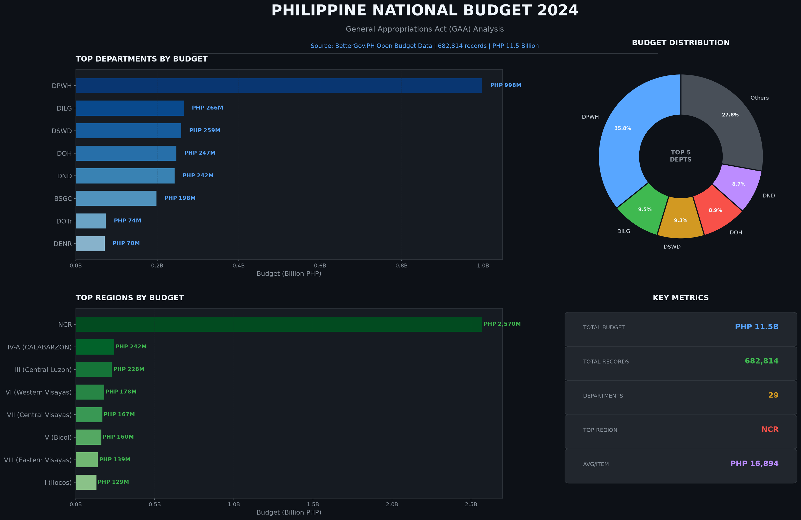

# Philippine National Budget 2024 Analysis

A data engineering project analyzing the Philippine national budget using **Python**, **SQL**, and **Linux CLI tools**.

## 📊 Dashboard Overview



---

## ❓ Questions This Dashboard Answers

### Department Analysis

| Question | Answer |
|----------|--------|
| Which department gets the most budget? | **DPWH** (Department of Public Works and Highways) with PHP 997.9M |
| How much does DPWH get compared to others? | **35.8%** of departmental budget (excluding LGU transfers) |
| What are the top 5 departments? | DPWH, DILG, DSWD, DOH, DND |
| How many government departments are there? | **29** unique departments |

### Regional Analysis

| Question | Answer |
|----------|--------|
| Which region gets the most budget? | **NCR** (National Capital Region) with PHP 2.57B |
| How much does NCR get compared to others? | **22.3%** of total regional allocation |
| What are the top 5 regions? | NCR, Region IV-A, Region III, Region VI, Region VII |
| How many regions are represented? | **17** regions |

### Budget Distribution

| Question | Answer |
|----------|--------|
| What is the total budget analyzed? | **PHP 11.5 Billion** |
| How many budget records are there? | **682,814** line items |
| What is the average budget per item? | **PHP 16,894** |
| What is the largest single budget item? | **PHP 5.77 Billion** |

### Data Quality

| Question | Answer |
|----------|--------|
| Are there any data quality issues? | Yes - 150,816 records (22%) are headers with zero amounts |
| How many records have actual budget? | **530,186** records with positive amounts |
| What is the data source? | **BetterGov.PH** (official GAA data from COA/DBM) |

---

## 🛠️ Tech Stack

| Tool | Purpose |
|------|---------|
| **Linux CLI** | Download, file management, exploration |
| **Python 3.12** | Data transformation, analysis |
| **pandas** | Data manipulation |
| **SQLite** | SQL queries |
| **matplotlib** | Visualization |
| **Power BI** | Interactive dashboards |

---

## 📁 Project Structure

```
ph-budget-analysis/
├── data/
│   ├── raw/              # Original JSON files (7 batches)
│   ├── clean/            # Processed CSV + SQLite
│   ├── powerbi/          # Excel files for Power BI
│   └── charts/           # Visualization images
├── scripts/
│   ├── combine_all_batches.py    # Merge all 7 batches
│   ├── analyze_with_python.py    # Python analysis
│   ├── analyze_with_sql.py       # SQL analysis
│   ├── export_for_powerbi.py     # Power BI export
│   └── visualize_budget.py       # Chart generation
├── docs/
│   ├── LINKEDIN_POST_DRAFT.md    # LinkedIn content
│   ├── POWERBI_GUIDE.md          # Power BI tutorial
│   └── INSIGHTS.md               # Key findings
└── .gitignore
```

---

## 🚀 Quick Start

```bash
# Clone repository
git clone https://github.com/kaizen-2004/ph-budget-analysis.git
cd ph-budget-analysis

# Activate Python environment
source ~/data-tools/bin/activate

# Run Python analysis
python3 scripts/analyze_with_python.py

# Run SQL analysis
python3 scripts/analyze_with_sql.py

# Generate charts
python3 scripts/visualize_budget.py
```

---

## 📈 Key Insights

1. **Infrastructure is priority** - DPWH gets the largest departmental budget
2. **NCR dominates** - Metro Manila gets 22% of all regional allocations
3. **Direct LGU transfers** - 75.8% of total budget goes directly to local governments
4. **Data is public** - All Philippine budget data is openly available

---

## 🔗 Data Source

- **Repository**: [BetterGov.PH Open Budget Data](https://github.com/bettergovph/open-budget-data)
- **Original Data**: Commission on Audit (COA) / Department of Budget and Management (DBM)
- **Dataset**: General Appropriations Act (GAA) 2024

---

## 📝 LinkedIn Post

See `docs/LINKEDIN_POST_DRAFT.md` for the complete LinkedIn post content.

---

## 📄 License

This project uses publicly available Philippine government data under open data principles.
